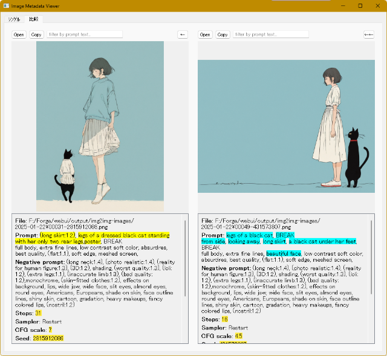
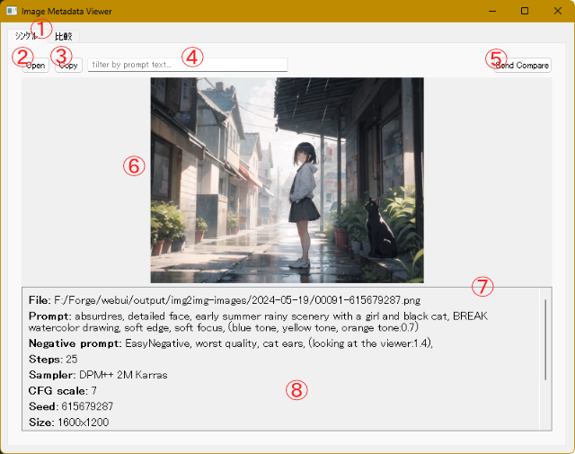
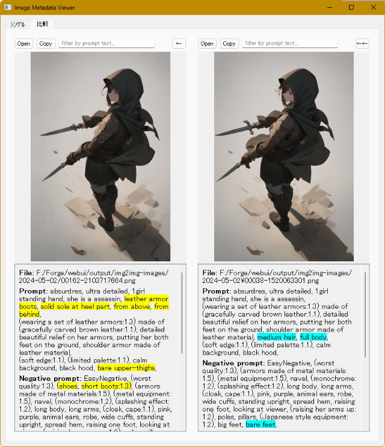

# pngviewer.py
 
pngviewer.py は、.png ファイル用の画像ビューアです。画像と一緒に、WebUI Forge によって生成されたメタデータを表示します。



## このツールでできること

プロンプト調整のお供に使用することを想定しています。

* 2 枚の画像とそのプロンプトを左右に並べて表示し、メタデータの差分をハイライト表示します。
* マウスのホイールで画像をブラウズする際に、指定したテキストがプロンプトに含まれている画像のみを表示対象にできます。
* 表示エリアの画像をつかんで、他のアプリケーションウィンドウにドロップできます (もちろん、Forge のプロンプトボックスにも)。

### できないこと

* 一般的な画像ビューアの機能 (回転とか反転表示とか) はありません。
* WebUI Forge で生成された画像**以外**では、メタデータは表示されません。

## 確認済みの動作環境

* Windows 11 24H2
* Python 3.10.6
* WebUI Forge f0.0.12

2023 年あたりの AUTOMATIC1111 で生成した画像も OK ですが、最近めのバージョンは確認していません。

## 変更履歴

2025/2/28  初期バージョン 0.2.0 を公開しました。

## インストール・実行方法

1. このスクリプトでは `PyQt5` と ``PIL`` のライブラリを使用します。必要に応じて、venv などしてください。

2. PyQt5 と pillow を pip install します。

```
pip install PyQt5 pillow
```

3. 本リポジトリをダウンロード・展開してください。

5. スクリプトを実行します。
```
python pngviewer.py
```

## 使い方

### 画面構成

スクリプトを実行すると次のようなウィンドウが表示されます (画像を読み込んだ状態です)。



1. タブボタン - [シングル] タブでは、1 枚の画像とそのメタデータを表示します。[比較] タブでは、2 枚の画像とそのメタデータを並べて表示できます。

2. [開く] ボタン - フォルダを指定して画像を開きます。

3. [コピー] ボタン - 表示している画像の ``Seed`` 値をクリップボードにコピーします。

4. テキストボックス - マウスホイールでブラウズ・表示する画像を、ここに入力したテキストがプロンプトに含まれている画像のみに制限します。

5. [送る] ボタン - 表示中の画像をほかのビューに転送します。

6. 画像エリア - 画像が表示されます。エリア内でマウスのホイールを操作すると、フォルダ内の画像が順次表示されます。画像はエリアのサイズに合わせて拡大縮小されます。また、画像エリアでマウスの左ボタンをクリックしたまま移動すると表示中の画像**ファイル**をドラッグした状態になり、そのまま他のアプリケーションウィンドウにドロップできます。

7. スプリッタ - 画像エリアとテキストエリアの高さを変更します。

8. テキストエリア - 表示中の画像ファイルのファイル名と、ファイルに記録されている生成情報が表示されます。

ヒント： 以下の説明では、1 画像ファイル分のボタン群 (ツールバー)・画像エリア・テキストエリアをまとめて「ビュー」と呼んでいます。

#### 画像の開き方

画像ファイルをビューに読み込むには、次の方法があります。

* [開く] ボタンでフォルダを指定して、フォルダ内の最初の画像を表示します。
* エクスプローラや他のアプリケーションから、ビューエリアに画像ファイルをドラッグ&ドロップします。
* 各ビューの [送る] ボタンを使用します。
* [比較] タブでは、ビューの画像エリアをドラッグして、もう一方のビューにドラッグ&ドロップできます。

#### [比較] タブ



[比較] タブでは、2 枚の画像とそれぞれのメタデータが左右に並べて表示されます。

表示されるアイテムやビューの構成は [シングル] タブとほぼ同じですが、次のように一部の動作が異なります。

* 左ビューのスプリッターを動かすと、右のビューのスプリッターも同時に (同じ高さに) 移動します。
* 各ビューの [送る] ボタンは、画像を [シングル] タブのビューに送ります。
* 左右両方のビューに画像が読み込まれている場合は、メタデータを比較してプロンプトの差分と、内容が異なるメタデータ要素をそれぞれハイライト表示します。

### プロンプトの差分について

プロンプト (およびネガティブプロンプト) のハイライト表示では、カンマで区切られた要素ごとに相違を確認します。したがって、たとえば「sleeping cat」と「sleeping, cat,」はすべて (カンマを除いて) ハイライト表示されます。また、左に「fox」、右に「brown fox」があった場合も両方ハイライトされます (brown だけがハイライトされたりはしません)。

### テキストボックスによる表示対象の制限

ホイールで画像をブラウズする際、テキストボックスに文字列が入力されていると、その文字列がプロンプトに含まれる画像ファイルだけが表示対象となります (対象外のファイルはスキップされます)。

差分ハイライトの処理とは違い、検索は元のプロンプト全体を 1 つの文字列と見なして実行されます。ですので、カンマも検索対象として使用されますし、連続するスペースも文字数分だけきっちり判定されます。

入力した検索テキストも、入力内容が (空白を含めて) 1 つの文字列として使用されます。and とか or とか、気の利いた指定はありません。もちろん not もありませんし、ネガティブプロンプトは検索できないステキ仕様です。でも大丈夫、ご心配には及びません。**正規表現が使えます**。

## その他

ファイルによって warning が出るケースがあるようですが、まだ確認できていません (調査中です)。

## 免責事項

当ソフトウェアの使用に関連して生じたいかなる損害、損失、またはトラブルについても、一切の責任を負いません。これには、データの損失、収益の損失、ビジネスの中断、およびその他の金銭的損失が含まれますが、これに限られません。

本スクリプトの作成にあたっては、Claude 3.5 Sonnet を利用しています。

## ライセンス

このリポジトリの内容は [MT License](./LICENSE) です。
