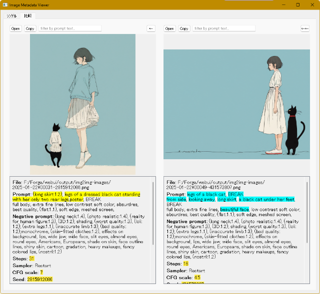
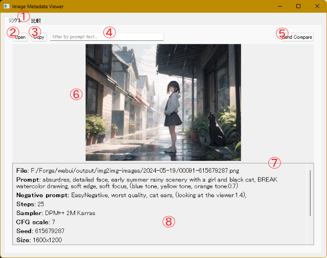
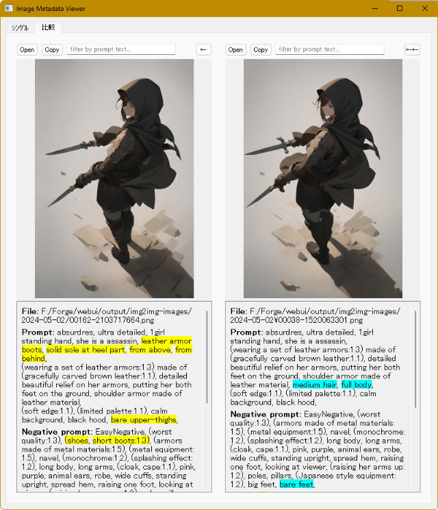
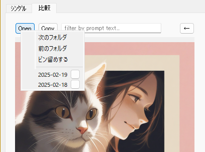
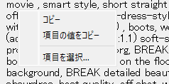
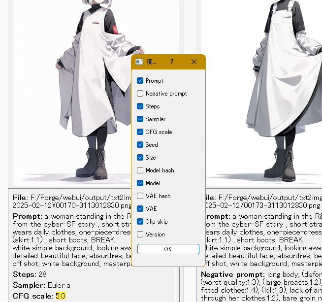
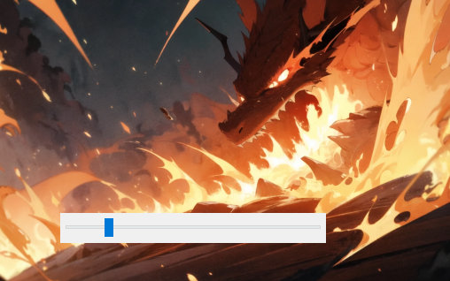
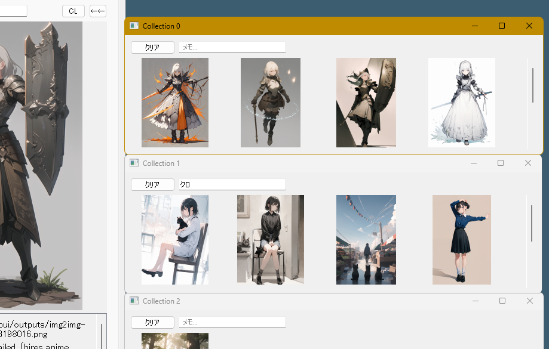

# pngviewer.py
 
pngviewer.py は、.png ファイル用の画像ビューアです。画像と一緒に、WebUI Forge によって生成されたメタデータを表示します。



## このツールでできること

プロンプト調整のお供に使用することを想定しています。

* 2 枚の画像とそれぞれのプロンプトを左右に並べて表示し、メタデータの差分をハイライト表示します。
* マウスのホイールで画像をブラウズする際に、指定したテキストがプロンプトに含まれている画像のみを表示対象にできます。
* 表示エリアの画像をつかんで、他のアプリケーションウィンドウにドロップできます (もちろん、Forge のプロンプトボックスにも)。
* 気になった画像の一時的なコレクションを作成できます。

### できないこと

* 一般的な画像ビューアの機能 (回転とか反転表示とか) はありません。
* WebUI Forge で生成された画像**以外**では、メタデータは表示されません。

## 確認済みの動作環境

* Windows 11 24H2
* Python 3.10.6
* WebUI Forge f0.0.12

2023 年あたりの WebUI (AUTOMATIC1111 版) で生成した画像でも動作しましたが、最近めのバージョンは確認していません。

## 変更履歴

現在の最新バージョンは 0.4.0 です。

2025/03/15 バージョン 0.4.0 を公開しました。
- コレクション機能を追加しました。
- 画像を原寸で表示できるようにしました。

コレクション機能の詳細については、「[コレクションウィンドウ](#コレクションウィンドウ)」のセクションを参照してください。

原寸表示については、「[画面構成](#画面構成)」のセクションを参照してください。

2025/03/07  バージョン 0.3.0 を公開しました。
- フォルダのピン留め機能 (一時的なブックマーク機能) を追加しました。
- メタデータの項目ごとに表示/非表示を選択できるようにしました。
- 画像エリアの右クリックで、ブラウズ用のスライダーが表示されるようにしました。

2025/02/28  初期バージョン 0.2.0 を公開しました。
- 基本機能を実装しました。


## インストール・実行方法

1. このスクリプトでは `PyQt5` と ``PIL`` のライブラリを使用します。必要に応じて、venv などしてください。

2. PyQt5 と pillow を pip install します。

```
pip install PyQt5 pillow
```

3. 本リポジトリをダウンロード・展開してください。

4. スクリプトを実行します。
```
python pngviewer.py
```

## 使い方

### 画面構成

スクリプトを実行すると次のようなウィンドウが表示されます (画像を読み込んだ状態です)。



1. タブボタン - [シングル] タブでは、1 枚の画像とそのメタデータを表示します。[比較] タブでは、2 枚の画像とそのメタデータを並べて表示できます。

2. [開く] ボタン - フォルダを指定して画像を開きます。

3. [コピー] ボタン - 表示している画像の ``Seed`` 値をクリップボードにコピーします。

4. テキストボックス - マウスホイールでブラウズ・表示する画像を、ここに入力したテキストがプロンプトに含まれている画像のみに制限します。

5. [送る] ボタン - 表示中の画像をほかのビューに転送します。

6. 画像エリア - 画像が表示されます。エリア内でマウスのホイールを操作すると、フォルダ内の画像が順次表示されます。画像はエリアのサイズに合わせて拡大縮小されます。また、画像エリアでマウスの左ボタンをクリックしたまま移動すると表示中の画像**ファイル**をドラッグした状態になり、そのまま他のアプリケーションウィンドウにドロップできます。

7. スプリッタ - 画像エリアとテキストエリアの高さを変更します。

8. テキストエリア - 表示中の画像ファイルのファイル名と、ファイルに記録されている生成情報が表示されます。

画像エリアの画像をダブルクリックすると新しいウィンドウが開き、画像が元のサイズで表示されます。ウィンドウ内の任意の場所でマウスを左クリックして、ドラッグで移動できます。ウィンドウを閉じるには、ウィンドウ内をダブルクリックしてください。

### 画像の開き方

1 画像ファイル分のボタン群 (ツールバー)・画像エリア・テキストエリアをまとめて「ビュー」と呼びます。[シングル] タブにはビューが 1 つ、[比較] タブにはビューが 2 つ表示されます。

画像ファイルをビューに読み込むには、次の方法があります。

* [開く] ボタンでフォルダを指定して、フォルダ内の最初の画像を表示します。
* エクスプローラや他のアプリケーションから、ビューエリアに画像ファイルをドラッグ&ドロップします。
* 各ビューの [送る] ボタンを使用します。
* [比較] タブでは、ビューの画像エリアをドラッグして、もう一方のビューにドラッグ&ドロップできます。

### [比較] タブ



[比較] タブでは、2 枚の画像とそれぞれのメタデータが左右に並べて表示されます。

表示されるアイテムやビューの構成は [シングル] タブとほぼ同じですが、次のように一部の動作が異なります。

* 左ビューのスプリッターを動かすと、右のビューのスプリッターも同時に (同じ高さに) 移動します。
* 各ビューの [送る] ボタンは、画像を [シングル] タブのビューに送ります。
* 左右両方のビューに画像が読み込まれている場合は、メタデータを比較してプロンプトの差分と、内容が異なるメタデータ要素をそれぞれハイライト表示します。

#### プロンプトの差分について

プロンプト (およびネガティブプロンプト) のハイライト表示では、カンマで区切られた要素ごとに相違を確認します。したがって、たとえば「sleeping cat」と「sleeping, cat,」はすべて (カンマを除いて) ハイライト表示されます。また、左に「fox」、右に「brown fox」があった場合も両方ハイライトされます (brown だけがハイライトされたりはしません)。

### テキストボックスによる表示対象の制限

ホイールで画像をブラウズする際、テキストボックスに文字列が入力されていると、その文字列がプロンプトに含まれる画像ファイルだけが表示対象となります (対象外のファイルはスキップされます)。

差分ハイライトの処理とは違い、検索は元のプロンプト全体を 1 つの文字列と見なして実行されます。ですので、カンマも検索対象として使用されますし、連続するスペースも文字数分だけきっちり判定されます。

入力した検索テキストも、入力内容が (空白を含めて) 1 つの文字列として使用されます。and とか or とか、気の利いた指定はありません。もちろん not もありませんし、ネガティブプロンプトは検索できないステキ仕様です。でも大丈夫、ご心配には及びません。**正規表現が使えます**。

### 右クリックの動作

ウィンドウ内でマウスを右クリックすると、クリックした UI 要素や位置に応じてコンテキストメニューやブラウズ用の UI が表示されます。

#### [開く] ボタン

[開く] ボタンの上でマウスを右クリックすると、次のようなメニューが表示されます。



* 次のフォルダ / 前のフォルダ： 現在のフォルダと同じ階層でフォルダを移動します。

* ピン留めする： 現在開いているファイルを含むフォルダを、コンテキストメニューにピン留めします。

ピン留めされたフォルダはメニューの下部に表示され、フォルダ名をクリックして移動できます。

フォルダ名の横にある四角いボタンをクリックすると、フォルダのピン留めが解除されます (実際に解除されるのは、メニューを閉じたタイミングです)。ピン留めしたフォルダのリストは、ビューごとに管理されます。

#### [送る] ボタン

* 送って移動： マウスの左ボタンでクリックしたときと同様に、現在のビューを他のビューに送ったあと、表示を送り先のビューに変更します。タブボタンをクリックする手間を省けます。

#### メタデータ表示エリア

メタデータの表示エリアで各項目を右クリックすると、次のメニューが表示されます。



* コピー： 選択されているテキストをクリップボードにコピーします。

* 項目の値をコピー： マウスを右クリックした位置にある項目の値を、すべてクリップボードにコピーします。

* 項目を選択： 項目の表示/非表示を選択する、次のようなダイアログボックスを開きます。



 
 ファイルに含まれているメタデータの項目が一覧で表示されますので、表示したい項目のチェックボックスをオンにして [OK] をクリックしてください。
 ここで選択した設定はビューごとに管理されます。

#### 画像エリア

画像エリアでマウスを右クリックするとスライダーが表示されます。



スライダーのハンドルを左右に移動すると、その位置に応じて表示画像が切り替わります。

表示される画像は、現在表示中のファイルと同じフォルダにある画像で、スライダーの一番左がフォルダ内の 1 番目の画像、一番右がフォルダ内の最後のファイルに対応します (上部テキストボックスによるフィルタは適用されません)。

### コレクションウィンドウ

画像をコレクションとしてストックできるウィンドウです (バージョン 0.4.0 以降)。



メインウィンドウの [CL] ボタンをクリックすると、上の画像のようなコレクションウィンドウが表示されます (画像では 3 枚開いています)。

このウィンドウには次のような機能があります。

- ドラッグ&ドロップした画像がサムネイルで表示されます。
- 表示されているサムネイルをドラッグして、メインウィンドウや他のアプリケーションにドロップできます。

たとえば、インペイント作業中に目に付いた画像をマークしておきたいときや、[比較] タブで 3 枚以上の画像を見比べたい場合など、一時的なブックマークまたはストック場所として利用できます。

ヒント： コレクションウィンドウ内の操作で元のファイルが変更されることはありません。

#### 使い方

**サムネイルの追加**: コレクションウィンドウに画像を追加するには、画像ファイルをドラッグしてウィンドウ内にドロップします。メインウィンドウからはもちろんですが、他のアプリケーションからのドラッグ&ドロップや、コレクションウィンドウ間のドラッグ&ドロップも可能です。

**サムネイルの削除**: サムネイルを 1 つ削除する場合は、目的のサムネイルを右クリックして [削除] を選択してください。1 つのウィンドウ内のすべてのサムネイルを削除する場合は、ウィンドウ上部の [クリア] をクリックします。

**サムネイルの並べ替え**: コレクションウィンドウ内でサムネイルの並び順を変更するには、サムネイルをドラッグして目的の位置 (他のサムネイルの上) にドロップします。ドラッグしたサムネイルが、ドロップした位置に挿入されます。

**メモ機能**: 上部のテキストボックスはメモ欄です。覚え書きなどにお使いください (連動する機能などはありません)。

**動作一般**

* コレクションウィンドウは複数開くことができ、それぞれが独立して動作します。同じ画像を 1 つのウィンドウに 2 回登録することはできませんが、別のウィンドウへは (それぞれのウィンドウに 1 回ずつ) 登録可能です。

* ウィンドウを開くボタンは各ビューにありますが、どのビューから開いても動作は同じです (特定のビューに結び付くことはありません)。

* ウィンドウを閉じる場合は、システムの [閉じる] ボタン (Windows なら右上の X ボタン) を使用してください。

収集したコレクションを保存する機能はありません。

## その他

ファイルによって warning が出るケースがあるようですが、まだ確認できていません (調査中です)。

## 免責事項

当ソフトウェアの使用に関連して生じたいかなる損害、損失、またはトラブルについても、一切の責任を負いません。これには、データの損失、収益の損失、ビジネスの中断、およびその他の金銭的損失が含まれますが、これに限られません。

本スクリプトの作成にあたっては、Claude 3.5 Sonnet、3.7 Sonnet を利用しています。

## ライセンス

このリポジトリの内容は [MIT License](./LICENSE) です。
