# pngviewer.py
 
pngviewer.py は、.png ファイル用の画像ビューアです。画像と一緒に、WebUI Forge によって生成されたメタデータを表示します。

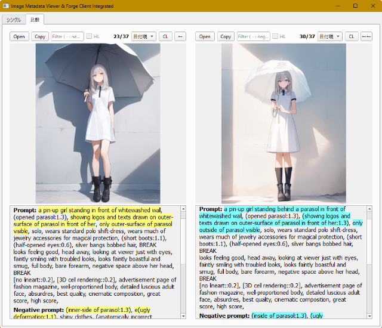

## このツールでできること

プロンプト調整のお供に使用することを想定しています。

* 2 枚の画像とそれぞれのプロンプトを左右に並べて表示し、メタデータの差分をハイライト表示します。
* マウスのホイールで画像をブラウズする際に、指定したテキストがプロンプトに含まれている画像のみを表示対象にできます。
* 表示エリアの画像をつかんで、他のアプリケーションウィンドウにドロップできます (もちろん、Forge のプロンプトボックスにも)。
* 気になった画像の一時的なコレクションを作成できます。
* Forge の API を呼び出して画像を生成できます。


### できないこと

* 一般的な画像ビューアの機能 (回転とか反転表示とか) はありません。
* WebUI Forge で生成された画像以外では、メタデータは表示されません。

## 確認済みの動作環境

* Windows 11 24H2
* Python 3.10.6
* WebUI Forge f0.0.12

2023 年あたりの WebUI (AUTOMATIC1111 版) で生成した画像でも動作しましたが、最近めのバージョンは確認していません。

## 変更履歴

現在の最新バージョンは 0.5.0 です。

2026/07/26 バージョン 0.5.0 を公開しました。
- WebUI Forge の API を呼び出して画像を生成するパネルを追加しました。
- マウスホイールで画像をブラウズする際に日付順と名前順を選択できるようになりました。
- 表示中の画像がフォルダ内またはフィルタ対象内で何番目かを表示するようにしました。
- ブラウズ用のスライダにもフィルタ情報を適用するようにしました。
- ネガティブプロンプトにもフィルタを適用できるようになりました。
- フィルタしたキーワードをハイライト表示できるようになりました。
- コレクションウィンドウの内容を保存・読み込みできるようになりました。
- その他、バグ修正

生成パネルの詳細については、「[生成パネル](#生成パネル)」のセクションを参照してください。

2025/03/15 バージョン 0.4.0 を公開しました。
- コレクション機能を追加しました。
- 画像を原寸で表示できるようにしました。

2025/03/07  バージョン 0.3.0 を公開しました。
- フォルダのピン留め機能 (一時的なブックマーク機能) を追加しました。
- メタデータの項目ごとに表示/非表示を選択できるようにしました。
- 画像エリアの右クリックで、ブラウズ用のスライダーが表示されるようにしました。

2025/02/28  初期バージョン 0.2.0 を公開しました。
- 基本機能を実装しました。


## インストール・実行方法

1. このスクリプトでは `Pyside6`、`pillow`、`WMI`、`pywin32`、`requests` のライブラリを使用します。必要に応じて、venv などしてください。

2. 必要なライブラリを pip install します。

```
pip install Pyside6 pillow WMI pywin32 requests
```

3. 本リポジトリをダウンロード・展開してください。

4. スクリプトを実行します。
```
python pngviewer.py
```

## 使い方

### 画面構成

スクリプトを実行すると次のようなウィンドウが表示されます (画像を読み込んだ状態です)。

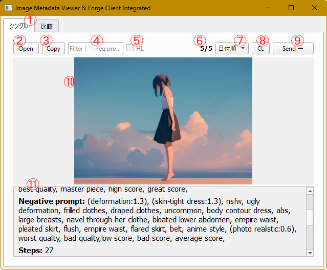

1. タブボタン - [シングル] タブでは、1 枚の画像とそのメタデータを表示します。[比較] タブでは、2 枚の画像とそのメタデータを並べて表示できます。

2. [開く] ボタン - フォルダを指定して画像を開きます。

3. [コピー] ボタン - 表示している画像の `Seed` 値をクリップボードにコピーします。

4. [フィルタ] テキストボックス - マウスホイールでブラウズする画像を、ここに入力したテキストがプロンプトに含まれている画像のみに制限します。キーワードの先頭に `-` (ハイフン) を付けるとフィルタの対象がネガティブプロンプトになります。

5. [ハイライト表示] ボタン - [フィルタ] ボックスに入力したフィルタキーワードをハイライト表示します。

6. マウスホイールでブラウズする際に表示対象となっている画像数と表示中の画像の位置を、`画像の位置/対象画像数` の形式で表示します。「対象画像数」は、フィルタが適用されていない場合はフォルダ内の画像数、フィルタが適用されている場合はそのフォルダ内でフィルタの対象となった画像数です。

7. 画像をブラウズする際の表示順を、ファイルの「日付順」と「名前順」から選択できます。

8. [コレクション] ボタン - [コレクション] ウィンドウを開きます。

9. [送る] ボタン - 表示中の画像をほかのビューに転送します。

10. 画像エリア - 画像が表示されます。エリア内でマウスのホイールを操作すると、フォルダ内の画像が順次表示されます。画像はエリアのサイズに合わせて拡大縮小されます。また、エリア内の画像をドラッグして、アプリ内の他のビューや他のアプリケーションウィンドウにドロップできます (データではなくファイル自体がドロップされます)。

11. テキストエリア - 表示中の画像ファイルのファイル名と、ファイルに記録されている生成情報が表示されます。画像エリアとの境界部分をドラッグしてエリアのサイズを変更できます。

画像エリアの画像をダブルクリックすると新しいウィンドウが開き、画像が元のサイズで表示されます。ウィンドウ内の任意の場所でマウスを左クリックして、ドラッグで移動できます。ウィンドウを閉じるには、ウィンドウ内をダブルクリックするか `Esc` キーを押してください。

### 画像の開き方

1 画像ファイル分のボタン群 (ツールバー)・画像エリア・テキストエリアをまとめて「ビュー」と呼びます。[シングル] タブにはビューが 1 つ、[比較] タブにはビューが 2 つ表示されます。

画像ファイルをビューに読み込むには、次の方法があります。

* [開く] ボタンでフォルダを指定して、フォルダ内の最初の画像を表示します。
* エクスプローラや他のアプリケーションから、ビューエリアに画像ファイルをドラッグ&ドロップします。
* 各ビューの [送る] ボタンを使用します。
* [比較] タブでは、ビューの画像エリアをドラッグして、もう一方のビューにドラッグ&ドロップできます。

### [比較] タブ

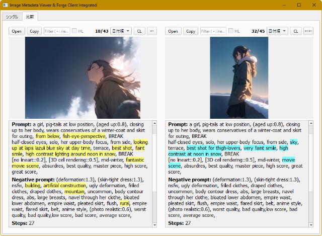

[比較] タブでは、2 枚の画像とそれぞれのメタデータが左右に並べて表示されます。

表示されるアイテムやビューの構成は [シングル] タブとほぼ同じですが、次のように一部の動作が異なります。

* 左ビューのスプリッターを動かすと、右のビューのスプリッターも同時に (同じ高さに) 移動します。
* 各ビューの [送る] ボタンは、画像を [シングル] タブのビューに送ります。
* 左右両方のビューに画像が読み込まれている場合は、メタデータを比較してプロンプトの差分と、内容が異なるメタデータ要素をそれぞれハイライト表示します。

#### プロンプトの差分について

プロンプト (およびネガティブプロンプト) のハイライト表示では、カンマで区切られた要素ごとに相違を確認します。したがって、たとえば「sleeping cat」と「sleeping, cat,」はすべて (カンマを除いて) ハイライト表示されます。また、左に「fox」、右に「brown fox」があった場合も両方ハイライトされます (brown だけがハイライトされたりはしません)。

### テキストボックスによる表示対象のフィルタリング

ホイールで画像をブラウズする際、テキストボックスに文字列が入力されていると、その文字列がプロンプトに含まれる画像ファイルだけが表示対象となります (対象外のファイルはスキップされます)。

ネガティブプロンプトでフィルタ処理したい場合は、検索語句の先頭に `-` (ハイフン) を付けてください。また、プロンプト全体を 1 つの文字列として検索していますので、AND で検索したい場合などは正規表現を利用してください。

テキストボックスの隣にある [HL] (HighLight) ボックスをオンにすると、検索語句がハイライト表示されます。[比較] タブでは、差分ハイライトとの切り替えになります。

### 右クリックの動作

ウィンドウ内でマウスを右クリックすると、クリックした UI 要素や位置に応じてコンテキストメニューやブラウズ用の UI が表示されます。

#### [開く] ボタン

[開く] ボタンの上でマウスを右クリックすると、次のようなメニューが表示されます。

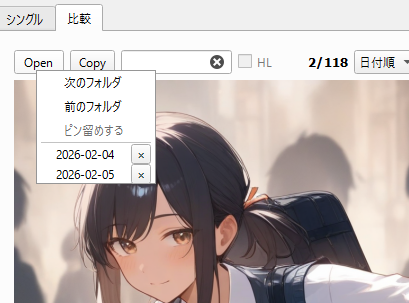

* 次のフォルダ / 前のフォルダ： 現在のフォルダと同じ階層でフォルダを移動します。

* ピン留めする： 現在開いているファイルを含むフォルダを、コンテキストメニューにピン留めします。

ピン留めされたフォルダはメニューの下部に表示され、フォルダ名をクリックして移動できます。

フォルダ名の横にある四角いボタンをクリックすると、フォルダのピン留めが解除されます (実際に解除されるのは、メニューを閉じたタイミングです)。ピン留めしたフォルダのリストは、ビューごとに管理されます。

#### [送る] ボタン

* 送って移動： マウスの左ボタンでクリックしたときと同様に、現在のビューを他のビューに送ったあと、表示を送り先のビューに変更します。タブボタンをクリックする手間を省けます。

#### メタデータ表示エリア

メタデータの表示エリアで各項目を右クリックすると、次のメニューが表示されます。

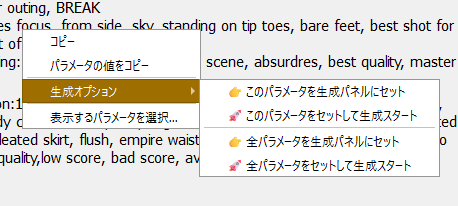

* コピー： 選択されているテキストをクリップボードにコピーします。

* パラメータの値をコピー： マウスを右クリックした位置にあるパラメータの値をクリップボードにコピーします。

* 生成オプション： Forge の API 呼び出しを利用して画像生成を行うパネルを開き、クリックした位置のパラメータまたは画像のすべてのパラメータをパネルにセットします (もしくは、セットしてすぐに生成を開始します)。

* 表示するパラメータを選択： 各パラメータの表示/非表示を選択する、次のようなダイアログボックスを開きます。

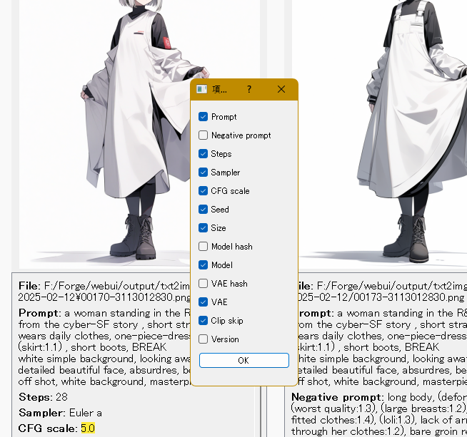
 
 ファイルに含まれているメタデータの項目が一覧で表示されますので、表示したい項目のチェックボックスをオンにして [OK] をクリックしてください。
 ここで選択した設定はビューごとに管理されます。

#### 画像エリア

画像エリアでマウスを右クリックするとスライダーが表示されます。

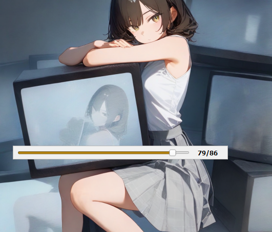

スライダーのハンドルを左右に移動すると、その位置に応じて表示画像が切り替わります。

表示される画像は、現在表示中のファイルと同じフォルダにある画像で、スライダーの一番左がフォルダ内の 1 番目の画像、一番右がフォルダ内の最後のファイルに対応します (フィルタ設定も適用されます)。

### コレクションウィンドウ

画像をコレクションとしてストックできるウィンドウです。

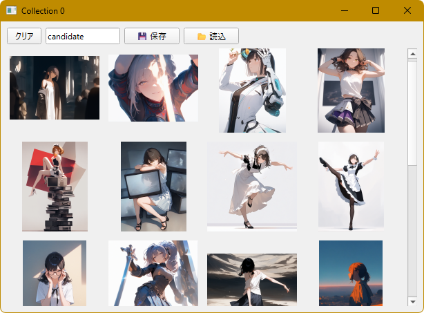

メインウィンドウの [CL] ボタンをクリックすると、上の画像のようなコレクションウィンドウが表示されます (画像を追加した状態です)。

このウィンドウには次のような機能があります。

- ドラッグ&ドロップした画像がサムネイルで表示されます。
- 表示されているサムネイルをドラッグして、メインウィンドウや他のアプリケーションにドロップできます。
- サムネイルをダブルクリックすると、別のウィンドウを開いてオリジナルのサイズで画像が表示されます。
- 現在のコレクションの内容を保存して、あとで読み込むことができます。

たとえば、インペイント作業中に目に付いた画像をマークしておきたいときや、[比較] タブで 3 枚以上の画像を見比べたい場合など、一時的なブックマークまたはストック場所として利用できます。

ヒント： コレクションウィンドウ内の操作で元のファイルが変更されることはありません。

#### 使い方

**サムネイルの追加**: コレクションウィンドウに画像を追加するには、画像ファイルをドラッグしてウィンドウ内にドロップします。メインウィンドウからはもちろんですが、他のアプリケーションからのドラッグ&ドロップや、コレクションウィンドウ間のドラッグ&ドロップも可能です。

**サムネイルの削除**: サムネイルを 1 つ削除する場合は、目的のサムネイルを右クリックして [削除] を選択してください。1 つのウィンドウ内のすべてのサムネイルを削除する場合は、ウィンドウ上部の [クリア] をクリックします。

**サムネイルの並べ替え**: コレクションウィンドウ内でサムネイルの並び順を変更するには、サムネイルをドラッグして目的の位置 (他のサムネイルの上) にドロップします。ドラッグしたサムネイルが、ドロップした位置に挿入されます。

**メモ**: 上部のテキストボックスはメモ欄です。覚え書きなどにお使いください。コレクションを保存するときのタイトルとしても使用されます。

**保存、読込**: 現在のコレクションの保存と、保存済みコレクションの読み込み行います。[保存] ボタンをクリックすると、現在のコレクションの内容が「メモに入力しているテキスト+日時」形式のタイトルを付けて保存されます。[読込] ボタンをクリックすると、[コレクションの読み込み] ダイアログボックスが開き、保存したコレクションの一覧が表示されますので、タイトルを選択して [選択して開く] をクリックしてください。不要になったコレクションは、この画面の [削除] ボタンで削除できます。

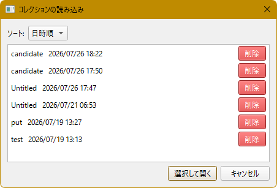

**メモ**: メモ欄に入力がない場合は代わりに「Untitled」の文字列が使用されます。また、実際に保存されるデータはコレクションに追加されているファイルのリストで、./collections フォルダに json ファイルとして保存されます。

**その他の動作について**

* コレクションウィンドウは複数開くことができ、それぞれが独立して動作します。同じ画像を 1 つのウィンドウに 2 回登録することはできませんが、別のウィンドウへは (それぞれのウィンドウに 1 回ずつ) 登録可能です。

* コレクションウィンドウを開くボタンは各ビューにありますが、どのビューから開いても動作は同じです (特定のビューに結び付くことはありません)。

* コレクションウィンドウを閉じる場合は、システムの [閉じる] ボタン (Windows なら右上の X ボタン) を使用してください。


### 生成パネル

Forge の API を呼び出すパネルを開いて画像生成を行います。


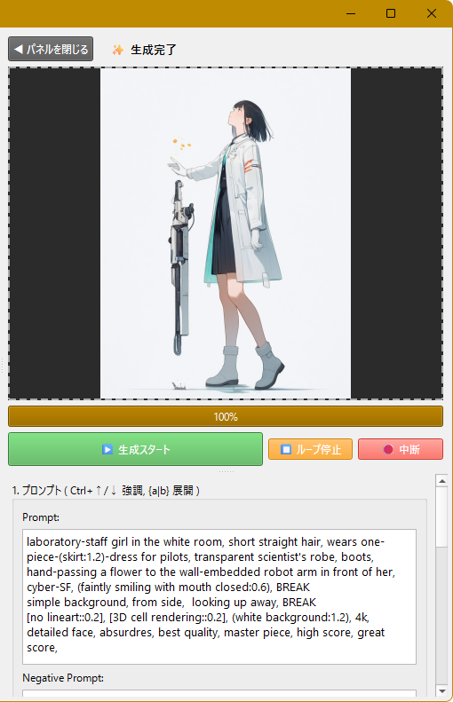

#### 準備

API 呼び出しを利用できるように、Forge の起動オプションに `--api` を追加します。起動用のバッチファイル (Forge がインストールされているフォルダの `webui/webui.bat` など) の
```
set COMMANDLINE_ARGS=
```
行の末尾に `--api` を追加して保存してください。

API 呼び出しの URL はデフォルトで `http://127.0.0.1:7860` です。変更が必要な場合は、本スクリプトファイルの先頭付近にある
```
FORGE_URL = "http://127.0.0.1:7860"
```
を修正してください。

注意： プロンプトやパラメータを微調整する際の使用を想定していますので、このパネルは簡単な機能しか備えていません。また Forge 本体の UI と同じ動作を保証するものではありません。

#### 使用方法

 パネルを開くには、各ビューのテキストエリアを右クリックして [生成オプション] のいずれかのオプションを選択してください。ビューの右側にパネルが開き、選択したオプションに応じてパネルにパラメータが設定されます (あるいはすぐに生成が開始されます)。

パネルを開いたあとは、上部プレビューエリアに画像をドロップすることでパラメータを設定することもできます。

[プロンプト] エリアでは、簡易ですが `Ctrl+矢印キー` による強調の指定と、`{ | }` によるテキストの展開を行えます。プロンプトを展開するときにシードを固定したい場合は、パネル最下部の [Fixed seed] チェックボックスをオンにしてください (デフォルトでオンです)。

[Steps] については `,` (カンマ)区切りで複数の値を設定できます。他のパラメータを固定した状態で、指定したステップの数だけ生成を行います (「27,28」と指定すると、ステップを 27 で生成した画像と 28 で生成した画像の 2 枚が出力されます。)。
     
そのほかのパラメータは Forge の UI と同じ内容です (自分でよく使うパラメータしか配置してませんので不足がある点はご了承ください)。

生成された画像は、デフォルトではアプリのディレクトリ以下の `outputs` フォルダに日付ごとに、`フォルダ内の連番+シード番号.png` のファイル名で保存されます。フォルダを変更する場合は、[3. 保存先 & モデル] エリアで指定してください。

使用するモデルもこのエリアで変更できます。

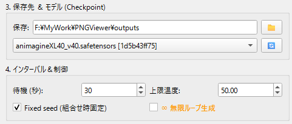

アプリ作者の PC は熱に弱いため、連続で生成を続けていると Windows が BSoD してしまいます。こういうトラブルとは縁のない方の方が多いと思いますが、画像を 1 枚生成するごとに [4. インターバル&制御] エリアの [待機] に指定した値だけインターバルをとり、かつ CPU 温度が [上限温度] 以下に下がるまで生成を開始しない仕組みになっています (温度を取得できない場合はタイマーだけのチェックになります)。この機能が不要な方は適当な値を設定しておいてください。

なお、CPU 温度は WMI 経由で取得しています。Libre Hardware Monitor などの Web サーバー機能を利用できます。

エリア最下段の [無限ループ] チェックボックスをオンにすると、Forge の [Generate forever] のような繰り返し生成を行います。このとき、プロンプトの `{ | }` や複数のステップが設定されていれば、それらも生成ループ中に考慮されます。

パラメータや設定は生成の実行中 (および待機中) にも変更できます。生成中にパラメータが変更されるとオレンジ色の [生成処理中] ボタンが次のような [適用] ボタンに変化します。

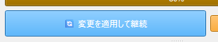

このボタンを押すと、次回の生成分から変更したパラメータが有効になります。

## その他

本スクリプトの作成にあたっては、Claude 3.5 Sonnet、3.7 Sonnet (ビューア部分のオリジナル)、および Gemini 3.1 Pro (Pyside への対応、生成パネル) を利用しています。

## 免責事項

当ソフトウェアの使用に関連して生じたいかなる損害、損失、またはトラブルについても、一切の責任を負いません。これには、データの損失、収益の損失、ビジネスの中断、およびその他の金銭的損失が含まれますが、これに限られません。

本ツールは WebUI Forge の API を利用して画像生成を行いますが、Forge 本体の導入や API の有効化 (--api オプションの追加等) に関する個別環境でのトラブルシューティングはサポート対象外となります。Forge 本体の導入やモデルファイルの準備、API の有効化はユーザーご自身の環境と責任において行ってください。

連続生成時のインターバルや CPU 温度監視機能を提供していますが、本ツールの使用によって生じた PC の過熱やハードウェアの故障について、作者は一切の責任を負いません。

また、本ツールを介して生成された画像の著作権、第三者の権利侵害、およびそれに伴う法的トラブルについても、作者は一切の責任を負いかねます。


## ライセンス

本ツール自体は [MIT License](./LICENSE) のもとで提供されます。

ただし、生成機能を利用する際に通信する WebUI Forge 本体、およびユーザーが用意したモデルファイル (Checkpoint 等) は、それぞれの配布元が定める個別のライセンス (CreativeML Open RAIL-M など) に準拠します。ユーザーは本ツールを利用するにあたり、これら外部リソースの利用規約を別途確認し、遵守する義務があります。
